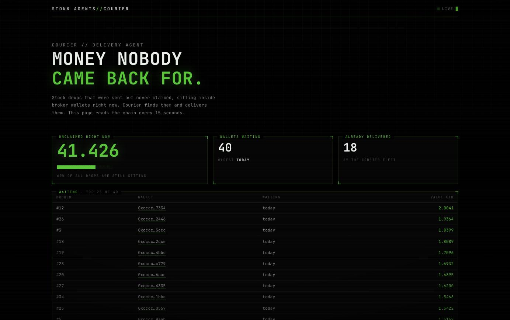
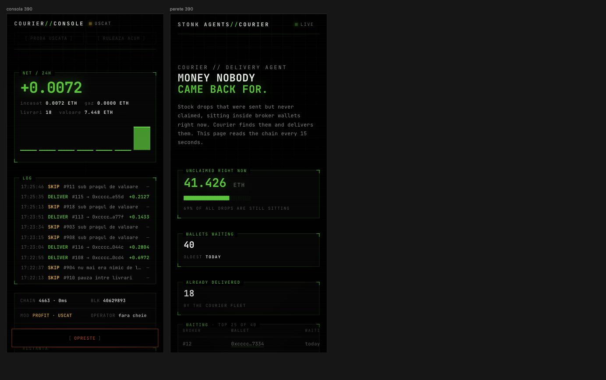
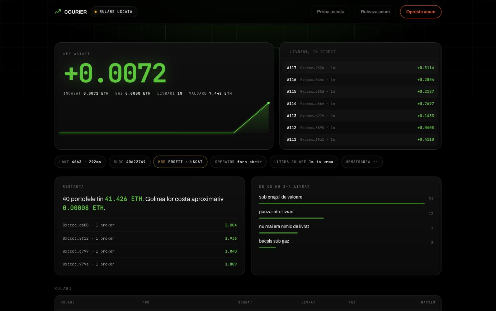
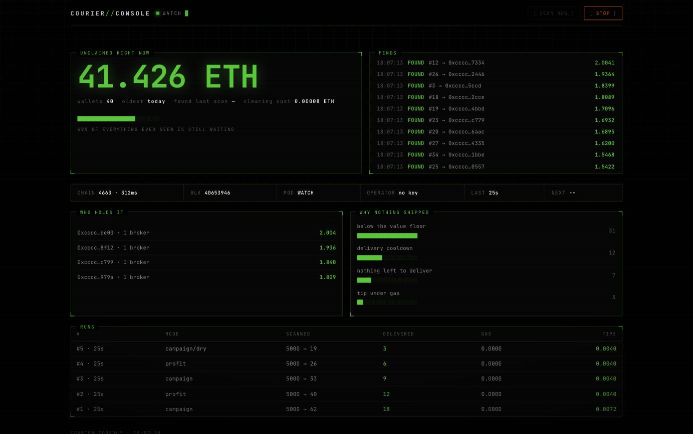

# Courier

Primul agent din flota Stonk Agents. Gaseste drop-urile nerevendicate care zac
in portofelele ERC-6551 ale brokerilor si le livreaza, incaseaza bacsisul si
scrie tot ce a facut intr-un registru din care iese, dupa o luna de rulare,
contul de profit si pierdere al unui agent.

Nu e un demo si nu e un MVP. Are simulare inainte de fiecare tranzactie, frane
de cheltuiala, reconciliere dupa cadere, alerte, API de citire si teste
cap-coada pe un lant real cu contracte reale.

## Contractul agentului

`contracts/src/StonkAgent.sol`, desfasurabil oricand, cu 14 teste pe lant.
Trei decizii sunt scrise in cod, nu in prezentare:

**Un singur tip de agent, cu slot de rol.** Nu cinci clase. Daca vinzi cinci
clase si exista o singura unealta care merge, patru cincimi din colectie e marfa
moarta din prima zi. Rolul se instaleaza si se schimba cand apare o unealta noua,
deci agentii vechi nu devin inutili.

**Contractul nu promite niciun randament.** Nu tine bani, nu imparte castiguri,
nu are functie de revendicare. Ce castiga agentul ajunge direct in portofelul lui
6551. Un contract care promite venit din munca altcuiva e exact forma pe care nu
vrei sa o ai.

**Mintul arde si nu retine nimic.** Jumatate la adresa moarta, jumatate la
trezorerie, procentele fixate la desfasurare. Testul verifica pe lant ca soldul
contractului ramane zero.

Pentru cine cumpara: `snapshot(tokenId)` da proprietarul, portofelul, soldul lui,
rolul si un **contor care se misca la fiecare transfer**. Nimic on-chain nu
opreste un vanzator sa isi goleasca portofelul in acelasi bloc cu vanzarea; ce se
poate face e sa ii dai cumparatorului cu ce sa verifice atomic, in aceeasi
tranzactie. Cumpararea in siguranta trece printr-un contract care compara si da
revert daca nu se potriveste.

Desfasurare:

```bash
cp config/deploy.example.json config/deploy.json   # completezi adresele
npx tsx scripts/deploy-agent.ts                    # doar arata, nu desfasoara
DEPLOYER_KEY=0x... npx tsx scripts/deploy-agent.ts --live
```

Rularea uscata verifica intai ca lantul e cel asteptat si ca fiecare adresa
presupusa are cod, si se opreste daca nu. Mintul ramane **inchis** dupa
desfasurare: se deschide separat, dupa ce definesti rolurile si scoti prototipul.

## Pregatirea de lansare

Planul, blocajele si cine raspunde de fiecare: **[LAUNCH.md](LAUNCH.md)**.
Pe scurt: intrebarea cu `deliver()` blocheaza livrarea, nu si indexul, deci
etapa 1 (veghe) poate porni in saptamana in care primim adresele.

## Pagini publice

| ruta | ce arata |
|---|---|
| `/` | peretele uitatilor: tot ce zace nerevendicat |
| `/w/0x...` | **pagina unei adrese**: ce are de luat si ce i s-a livrat |
| `/a/0` | **pagina unui agent**: ce a livrat si cat a castigat bucata aia |
| `/leaderboard` | clasamentul flotei |

Peretele general e frumos, dar nimeni nu il da mai departe. Pagina LUI, cu banii
LUI, da. De aia fiecare rand din perete duce la `/w/`, si de aia alerta de
Telegram contine acelasi link.

## Atribuirea pe agent

Fiecare rand din registru poarta **id-ul agentului** care a facut treaba. Fara
asta, Courier ramane "botul nostru": registrul stie ce s-a livrat, dar nu cine a
livrat, si nu se poate dovedi niciodata ce a castigat o bucata anume. Toata
povestea colectiei sta pe fraza "agentul TAU munceste".

Se pune de la inceput, inainte sa existe mintul: agentul `#0000` e prototipul
casei, iar in ziua lansarii are deja istoric adevarat.

Bazele facute inainte primesc coloana la pornire, fara sa se piarda niciun rand.

## Doua moduri

**Veghe** (`courier start --watchtower`, sau `"watchtower": true` in config):
scaneaza, tine indexul si anunta. **Nu simuleaza, nu semneaza, nu livreaza**,
chiar daca exista o cheie in mediu, si exista un test care cheama executorul
direct ca sa dovedeasca asta.

E modul cu care se poate lansa **inainte** sa fie limpede daca `deliver()` merge
apelata de un strain. Intrebarea aia blocheaza livrarea, nu si publicarea
indexului. Un supraveghetor e util din prima zi, nu cere voie nimanui si nu are
nimic de pierdut: fara cheie nu exista nici risc, nici gaz, nici greseala
posibila. Diagnosticul stie asta si nu mai cade pe intrebarea cu autorizarea.

Consola isi schimba singura subiectul: numarul erou nu mai e profitul, e **cat
zace nerevendicat acum**, logul arata descoperiri in loc de livrari, si raman
doua butoane, scanare si oprire.

**Curier** (implicit): tot ce face veghea, plus filtrare, simulare, livrare si
socoteala.

## De ce Courier si nu altul

Dintre cele cinci clase, Courier e singura care poate rula **azi, fara
permisiunea nimanui, fara fonduri in risc si oricand**. Nu e o cursa de viteza
ca Ringer, nu atinge bankroll-ul protocolului ca Stocker, nu cere delegare de
vot ca Lobbyist. Se poate porni inainte de mint, pe banii vostri, iar rezultatul
lui e o cifra reala pe care o pui pe landing page in loc de o promisiune.

## Intrebarea de la pasul zero

Tot conceptul sta intr-o singura linie de contract: **`deliver()` merge apelata
de un strain?** Daca e rezervata proprietarului, Courier-ul nu poate livra
pentru nimeni si trebuie ori opt-in, ori o schimbare de contract.

Nu ghicesti raspunsul si nu il cauti in cod:

```bash
courier doctor
```

Ultima verificare din lista raspunde. Si nu raspunde din textul erorii, care
poate fi orice, ci prin dovada: simuleaza acelasi apel din contul unui strain si
din contul proprietarului. Daca proprietarului ii merge si strainului nu, functia
e rezervata, si asta e demonstrat, nu banuit.

## Ce iti trebuie ca sa pornesti

Trei adrese si doua semnaturi:

1. adresa colectiei StonkBrokers,
2. adresa contractului care tine drop-urile,
3. registrul ERC-6551 folosit, implementarea si saltul,
4. semnatura functiei care spune cat e nerevendicat,
5. semnatura functiei de livrare.

Contractul de drop-uri se descrie prin semnaturi in fisierul de configurare, nu
prin cod. Cand vin adresele reale, se editeaza `config/default.json`, nu sursele.

Si nici semnaturile nu trebuie scrise de mana: `courier init <adresa>` citeste
ABI-ul verificat de pe explorer, urmareste proxy-ul catre implementare daca e
cazul, si propune candidatii cu punctaj si motiv. Alegerea ramane a ta, ca o
functie numita `claim` poate face trei lucruri diferite, dar nu mai pornesti de
la o pagina goala.

Verificat pe 19 august 2026: pe Robinhood Chain (4663) sunt deja desfasurate
registrul canonic ERC-6551, implementarea tokenbound si Multicall3. Adica
infrastructura pe care se sprijina Courier-ul exista deja acolo.

## Pornire

```bash
npm install
cp .env.example .env          # cheia sta aici, niciodata in config
cp config/robinhood.example.json config/default.json
# completezi cele doua adrese marcate TODO

npx tsx src/cli.ts init 0xADRESA_DROPS   # citeste ABI-ul si propune semnaturile
npx tsx src/cli.ts doctor     # trece tot?
npx tsx src/cli.ts scan       # cine are ceva nerevendicat
npx tsx src/cli.ts simulate   # ce s-ar livra, cu ce gaz, si de ce nu restul
npx tsx src/cli.ts run        # rulare completa, USCATA
npx tsx src/cli.ts run --live # abia asta semneaza ceva
```

Implicit nu se trimite nimic. `--live` se scrie de mana de fiecare data.

## Comenzi

| comanda | ce face |
|---|---|
| `init <adresa>` | citeste ABI-ul verificat de pe explorer si propune semnaturile pentru configurare |
| `start --watchtower` | mod de veghe: scaneaza si anunta, nu semneaza nimic |
| `doctor` | verifica lantul, contractele, matematica adreselor si daca `deliver()` e apelabila de un strain |
| `scan` | cine are ceva nerevendicat si cat valoreaza |
| `wall` | peretele uitatilor, din ultima scanare |
| `simulate` | ce s-ar livra, cu ce gaz si ce bacsis, plus motivul fiecarei excluderi |
| `run` | o rulare completa (uscata daca nu pui `--live`) |
| `start` | bucla continua, plus API si botul de Telegram |
| `serve` | doar API-ul de citire |
| `console` | doar consola de operator |
| `report` | cat a livrat, cat a castigat, cat a ars pe gaz, pe 24h, 7 zile si total |
| `tba <id>` | adresa portofelului 6551 al unui broker, calculata local si verificata cu registrul |

Optiuni globale: `-c <config>`, `--live`, `--campaign`.

## Cum functioneaza o rulare

1. **Reconciliere.** Tranzactiile ramase in aer de la rularea trecuta se
   verifica intai. Fara asta, contul de gaz iese gresit si pauzele dintre
   livrari se calculeaza pe o minciuna.
2. **Descoperire.** Id-urile brokerilor, prin interval, prin `tokenByIndex` sau
   prin evenimente `Transfer`.
3. **Adresele portofelelor.** Calculate local, prin CREATE2, fara nicio citire.
   Cinci mii de adrese ies instant.
4. **Scanare.** Cat e nerevendicat, in loturi, printr-un singur apel daca exista
   Multicall3.
5. **Filtrare.** Prag de valoare, pauza intre livrari, liste de excludere,
   optin, plafon pe rulare. Cele mai grase primele, ca taierea sa cada pe coada.
6. **Simulare, de doua ori.** Intai fiecare livrare separat, ca sa afli motivul
   exact al fiecarui esec. Apoi lotul supravietuitorilor, o data, ca sa afli
   bacsisul masurat si gazul real.
7. **Livrare.** In loturi, cu tolerare de esec: o livrare care pica nu darama
   lotul.
8. **Anunt si registru.** Canalul de Telegram, urmaritorii, si fiecare rand
   scris cu motiv, inclusiv cele care nu s-au facut.

## Franele

In ordinea in care se aplica:

- **modul uscat**, implicit pornit,
- **fisier de oprire**: daca `data/STOP` exista, nu pleaca nimic, si se verifica
  si intre loturi, nu doar la inceput,
- **plafon de pret al gazului**,
- **buget zilnic de gaz**,
- **prag de rentabilitate**: bacsisul trebuie sa acopere gazul inmultit cu o
  marja, altfel lotul se sare,
- **verificare de sold** inainte de semnare,
- **oprire dupa N rulari picate la rand**.

In modul campanie se livreaza si in pierdere, pentru livrarile gratuite dinainte
de mint, dar bugetul zilnic ramane in picioare. Altfel campania inseamna un
portofel gol pana dimineata.

## Bani si custodie

Courier-ul **nu atinge niciodata fondurile nimanui**. Cheama o functie publica
pe contractul de drop-uri, care trimite banii in portofelul brokerului. Noi
incasam doar bacsisul pe care il plateste protocolul.

`CourierBatch.sol` grupeaza livrarile intr-o tranzactie si imparte bacsisul
atomic intre portofelul agentului si trezorerie. Nu tine fonduri intre
tranzactii, nu are proprietar si nu are functie de upgrade. Taxa se ia din
**bacsis**, niciodata din valoarea livrata: un procent din ce livrezi ar
insemna sa te atingi de banii oamenilor.

## Telegram

Doua canale, o singura regula care le acopera pe amandoua: **botul e doar
citire**. Nu cere conectare de portofel, nu cere semnaturi, nu are nicio functie
care semneaza ceva. Omul lipeste o adresa publica si primeste evenimente pe care
oricine le vede pe explorer.

Regula are un efect secundar care valoreaza mai mult decat mesajul: daca e
publica si absoluta, orice bot clona care cere conectare se demasca singur.

Comenzi: `/watch 0x...`, `/unwatch`, `/list`, `/wall`, `/stats`.
Canalul public primeste fiecare livrare, iar peste un prag primeste rezumat, ca
sa nu ajunga pe mut intr-o saptamana. Rezumat zilnic la ora din configurare.
Alerta de gaz scazut, cel mult o data la sase ore.

## Peretele uitatilor

`GET /` serveste o pagina publica cu tot ce zace nerevendicat chiar acum:
totalul, cate portofele asteapta, de cate zile sta cel mai vechi, si tabelul cu
cele mai grase, cu link spre explorer. Se reimprospateaza singura la 15 secunde.

E artefactul care creeaza cerere inainte sa existe produsul, si care raspunde
singur la intrebarea "e real?". Pe pagina scrie, cu litere, ca nu se cere
niciodata conectare de portofel. Regula asta e si apararea impotriva clonelor:
daca e publica si absoluta, orice imitatie care cere conectare se demasca
singura.



Pe telefon amandoua se aseaza singure, iar in consola oprirea devine **buton
plutitor jos**, in zona degetului mare:



Ca sa o vezi fara contracte reale:

```bash
npx tsx scripts/demo-api.ts   # date de proba, http://127.0.0.1:8788/
```

## API de citire

Fara autentificare, pentru ca nu are ce sa protejeze: totul de aici e deja
public pe lant. Nicio ruta nu scrie.

| ruta | ce da |
|---|---|
| `/` | peretele uitatilor, ca pagina |
| `/health` | lant, bloc, mod |
| `/stats` | exact forma pe care o citeste landing page-ul: `{stats, feed, meta}` |
| `/wall` | peretele uitatilor, cu vechime |
| `/feed` | ultimele livrari, cu link spre explorer |
| `/report` | contul de profit si pierdere pe 24h, 7 zile si total |

Pe landing page se pune `SITE.live.endpoint` pe adresa lui `/stats` si cifrele
din hero devin reale.

Nicio ruta nu scrie, deci nu exista suprafata de atac de aparat. Limita de
cereri pe adresa IP e pornita implicit.

## Limba

**Tot ce vede omul e in engleza**: consola, peretele public, mesajele de
Telegram, linia de comanda, diagnosticul si motivele din log. Produsul se
adreseaza unui public global.

Comentariile din cod si documentul asta raman in romana, ca sunt pentru cine
lucreaza la el. Daca vrei si README-ul in engleza, se schimba dintr-o trecere.

## Pielea: terminal de trading

Peretele si consola folosesc o piele proprie, de terminal: **totul monospace,
colturi drepte, linii de un pixel, panouri cu titlul asezat pe muchia de sus**,
bare desenate din blocuri, log cu ceas.

Nu e nostalgie, e densitate. Intr-o unealta de operare, cu cat incap mai multe
randuri pe ecran fara sa oboseasca ochiul, cu atat afli mai repede ce se
intampla. Un panou aerisit cu placi mari arata bine in captura si te face sa
derulezi in productie.

Culorile raman ale proiectului, ca sa fie limpede ca e acelasi produs: negru,
verde `#00c805`, chihlimbar pentru avertismente, rosu pentru probleme. Site-ul
de prezentare ramane pe pielea lui curata; uneltele arata a unelte.

Totul in `src/ui/terminal.ts`, un singur loc de schimbat.

## Consola de operator## Consola de operator

`courier console`, sau pornita odata cu `start`. Acelasi limbaj vizual ca
site-ul: negru, un singur verde, cifre monospace.

Compozitia raspunde la trei intrebari, in ordinea asta:

1. **Fac bani acum?** Un singur numar erou, netul zilei, verde sau rosu, cu
   graficul ultimelor sapte zile sub el. Cand toate cifrele au aceeasi marime,
   ochiul nu stie unde sa se uite si panoul devine un tabel cu ambitii.
2. **E sanatos?** O banda de pastile: lantul si latenta lui, blocul, modul,
   soldul operatorului, ultima rulare, numaratoarea pana la urmatoarea.
3. **Cat mai am de facut?** Restanta, scrisa ca propozitie, cu costul estimat
   al golirii ei la gazul de acum, plus cine are cei mai multi bani uitati.

Langa numarul erou sta **fluxul de livrari in direct**, cu randuri noi care
intra cu o sclipire verde. Mai jos, **de ce nu s-a livrat**, grupat pe motive:
in productie intrebarea nu e niciodata "ce a livrat", e "de ce nu".

Trei butoane sus: **proba uscata** (calculeaza tot si nu trimite nimic),
**ruleaza acum** (rupe somnul buclei si porneste imediat) si **opreste**.



Acelasi panou in modul de veghe: numarul erou devine cat zace nerevendicat,
logul arata descoperiri, si raman doua butoane.



Si are un buton mare de oprit. Ala e motivul pentru care exista: la doua
noaptea vrei sa opresti de pe telefon, nu sa cauti laptopul si cheia de SSH.

**Granitele, si de ce sunt asa:**

- consola sta pe **alt port** decat API-ul public, legat implicit pe
  `127.0.0.1`, cu jeton din mediu (`CONSOLE_TOKEN`)
- **API-ul public ramane strict citire.** Tot ce scrie sta aici
- scriu doar trei lucruri: **opreste**, **porneste** si **cere o rulare**.
  Primele doua inseamna acelasi fisier de oprire, a treia doar ridica un steag
  pe care bucla il vede. Consola nu atinge chei, nu semneaza nimic, nu schimba
  politici si nu muta bani. Nu exista nicio alta ruta care scrie, si exista un
  test care incearca sa gaseasca una
- oprirea merge dintr-un singur clic: in incident nu vrei sa te intrebe nimic.
  Pornirea cere doua, ca sa nu repornesti din greseala ceva oprit dintr-un motiv

## Registrul e produsul

Se scrie si ce **nu** s-a livrat, si de ce. Dupa o luna de rulare in umbra,
`courier report` da livrari, valoare livrata, bacsis incasat si gaz ars.

Cifra aia decide supply-ul colectiei si pretul de mint. E diferenta dintre a
vinde pe baza unei sperante si a vinde pe baza unui numar pe care il poti arata.

Sumele stau ca text in baza de date, niciodata ca intreg: weiul depaseste ce
poate tine un numar din JavaScript, si o rotunjire tacuta acolo ar strica toate
cifrele de mai tarziu.

## Telegram, pas cu pas

1. `@BotFather`, `/newbot`, iei jetonul si il pui in `.env` la `TELEGRAM_TOKEN`.
2. Faci canalul public si adaugi botul ca administrator, cu drept de postare.
3. In configurare: `alerts.telegram.enabled: true` si `channel: "@numele-tau"`.
4. **Inregistreaza numele canalului si al botului acum**, inainte sa anunti ceva.
   Squatterii iau numele in ziua anuntului, si nu costa nimic sa le iei tu.

Canalul public primeste fiecare livrare, iar peste pragul din configurare
primeste un rezumat in loc de zece mesaje. Rezumat zilnic la ora setata, si
alerta de gaz scazut cel mult o data la sase ore.

## Testarea fara adresele reale

Nu ai adresele StonkBrokers? Se poate proba oricum, in trei feluri, si toate trei
sunt mai convingatoare decat obiectele false.

**1. Fork peste lantul real.** `npm run test:e2e` porneste si un anvil care
**forkeaza 4663 cu toata starea de productie**, si desfasoara distribuitorul de
proba peste ea. Diferenta care conteaza: registrul ERC-6551 si implementarea nu
mai sunt copiile mele, sunt **cele adevarate, deja desfasurate acolo**. Pe un
lant gol, daca as fi inteles gresit specificatia, si codul si testul ar gresi
la fel si nimic nu ar cadea. Pe fork, cade.

**2. Detectarea autorizarii pe un contract strain.** Tot pe fork, unealta
incearca `collect()` de la Uniswap V3, care e rezervata proprietarului pozitiei.
Un strain trebuie respins, proprietarul nu. E aceeasi verificare pe care o va
face pe `deliver()` la StonkBrokers, dar pe un contract pe care nu l-am scris eu
si nu il pot influenta.

**3. Citire pe un contract adevarat.** `config/uniswap.probe.json` pune Courier-ul
sa citeasca pozitiile Uniswap de pe 4663 prin configurare, fara nicio linie de
cod schimbata. Asa se vede daca stratul de adaptare chiar e agnostic:

```bash
npx tsx src/cli.ts scan -c config/uniswap.probe.json
```

Aici se vede si de ce exista **sablonul de argumente**: `collect()` cere o
structura cu patru campuri, nu un numar. In configurare se scrie
`[{ "tokenId": "$tokenId", "recipient": "$wallet", "amount0Max": "$max128" }]`,
si merge cu orice contract. Locuri goale: `$tokenId`, `$wallet`, `$owner`,
`$max128`, `$max256`, `$zero`, plus orice sir de cifre care devine numar intreg.

## Cat costa o livrare, masurat

`npx tsx scripts/economics.ts 60` forkeaza 4663, livreaza in loturi de marimi
diferite si masoara gazul consumat pe stare de productie, la pretul real de
acolo. Rulat pe 19 august 2026:

| livrari pe tranzactie | cost pe livrare (ETH) |
|---|---|
| 1 | 0.000149 |
| 5 | 0.000046 |
| 10 | 0.000038 |
| 25 | 0.000035 |
| 50 | 0.000031 |

**Gruparea taie 79% din cost.** Dar castigul se aplatizeaza: de la 25 la 50 mai
scazi doar 12%, fiindca partea fixa a tranzactiei e deja impartita la destui.
Peste acolo cresti doar riscul unui lot picat, nu si castigul. De aia
`batchSize` implicit e 25.

Doua concluzii pentru proiect, nu pentru cod:

- **bacsisul trebuie sa treaca de ~0.00003 ETH pe livrare** ca sa iasa pe zero,
  la lot de 50. Orice peste asta e profit.
- la costul asta, **campania de livrari gratuite dinainte de mint e practic
  gratuita**. O mie de livrari costa cat o cafea.

Contractul de proba nu e cel de la StonkBrokers, deci cifra absoluta se va
schimba cu al lor. Curba de grupare nu.

## Proba pe date reale

Testele cap-coada ruleaza pe un lant local, deci dovedesc logica. Asta dovedeste
altceva: ca drumul de citire tine pe lantul real.

```bash
npx tsx scripts/proof-live.ts 0x4A2C6e28D1FbAdeE3c11C4B4157f4bf2fe2A1f1a 2000
```

Rulat pe 19 august 2026, pe Robinhood Chain, pe o colectie adevarata de 100.000
de bucati cu zeci de mii de detinatori:

```
lant                          4663 la blocul 40043135
adrese calculate local        2000 in 94 ms, fara nicio citire
adrese cerute registrului     2000/2000 citite in 4145 ms
nepotriviri                   ZERO
proprietari cititi            2000/2000 in 4404 ms
pret gaz                      0.0000020406 ETH pentru 100k unitati
```

Doua concluzii care conteaza dincolo de cod:

- **matematica adreselor bate cu registrul de pe lantul real**, pe doua mii de
  bucati la rand. O colectie de cinci mii se scaneaza in cateva secunde.
- **gazul de acolo e neglijabil.** O livrare costa atat de putin incat modul
  campanie, adica livrarile gratuite dinainte de mint, e practic gratuit. Pragul
  de rentabilitate aproape ca nu conteaza pe lantul asta, ceea ce schimba
  socoteala in favoarea campaniei.

## Teste

```bash
npm test        # unitare
npm run test:e2e  # cap-coada, porneste anvil si desfasoara contracte reale
npm run test:all
```

97 de teste. Cap-coada nu foloseste obiecte false: porneste un lant local, desfasoara
registrul 6551, colectia, distribuitorul si contractul de lot, si demonstreaza
in ordine ca adresa calculata local e aceeasi cu cea de pe lant, ca scanarea
gaseste exact ce a fost pus, ca rularea uscata nu cheltuie nimic, ca livrarea
muta banii in portofelul brokerului si nu in al nostru, ca bacsisul se imparte
corect, si ca atunci cand functia e rezervata proprietarului unealta o spune
si nu arde gaz pe o tranzactie care ar da revert.

Franele sunt probate tot pe lant, intr-o rulare completa, nu chemate direct:
modul profit refuza lotul neprofitabil, campania il livreaza, bugetul zilnic si
plafonul de pret al gazului opresc rularea, fisierul de oprire opreste totul, si
pauza dintre livrari tine chiar cand a aparut marfa noua.

Telegramul e testat cu reteaua inlocuita: ce mesaj pleaca, cui, cand se
grupeaza, si ca nu exista nicio comanda care sa ceara semnatura sau cheie.

Trei bug-uri reale, prinse inainte de productie, ca exemplu de ce exista
testele si recitirea codului.

Primul: prima varianta a registrului lipea
adresa contractului NFT pe 20 de octeti in loc de 32, cum cere specificatia.
Ieseau alte adrese. Pe productie ar fi insemnat livrari catre portofele
inexistente.

Al doilea: bacsisul se tinea doar la nivel de rulare, deci raportul de profit
arata castig zero dupa livrari adevarate. Adica exact cifra pentru care exista
tot proiectul.

Al treilea, cel mai urat: fara contract de lot, executorul trimitea o singura
livrare dar inregistra tot grupul ca trimis. Registrul ar fi aratat zece livrari
acolo unde s-a facut una. Acum, fara contract de lot, o tranzactie duce exact o
livrare, garantat si probat.

## Desfasurare

```bash
docker compose up -d
```

Pe Coolify: aplicatie cu build pack Dockerfile, portul 8787, un volum montat pe
`/app/data` si variabilele din `.env` puse in panoul de mediu. Comanda de
pornire ramane cea din imagine. Healthcheck-ul e deja in Dockerfile si loveste
`/health`.

Datele stau pe volum: registrul e produsul, nu se pierde la redeploy.
Portul e legat pe `127.0.0.1`, se pune un reverse proxy in fata daca trebuie
expus.

Cheia operatorului sta in `.env`, pe server. **Wallet nou, facut pe server, cu
gaz cat pentru cateva zile, fara legatura cu nimic altceva.** Daca e compromisa,
se pierde doar gazul de pe el.

## Ce nu face

- Nu tine fondurile nimanui si nu cere aprobari peste ele.
- Nu semneaza nimic din Telegram.
- Nu castiga curse de viteza. Pe un lant cu secventiator care ordoneaza dupa
  momentul sosirii, cine e mai aproape castiga, iar gazul in plus nu ajuta.
  Courier-ul nu e proiectat pentru curse, ci pentru munca pe care nu o face
  nimeni.
- Nu inventeaza cifre. Ce nu poate masura, declara ca nemasurat.
